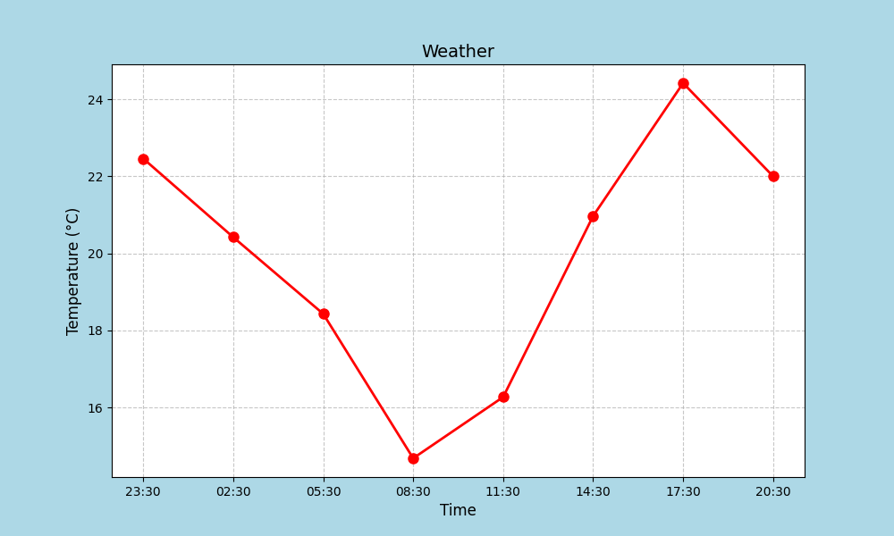

# WeatherHero Dashboard 🌦️

A Python script that fetches real-time weather forecasts from OpenWeatherMap and creates a vibrant temperature plot for any city, with a superhero flair!

## Features
- Uses `requests` to fetch weather data from the OpenWeatherMap API.
- Visualizes temperature trends over 24 hours using `matplotlib`.
- Displays a fun message with the current temperature.
- Supports secure API key handling with `.env` or direct input.

## Requirements
- Python 3.6+
- Libraries: `requests`, `matplotlib`, `python-dotenv` (optional for `.env` setup)
- OpenWeatherMap API key (get one for free at [openweathermap.org](https://openweathermap.org))

## Setup
### Option 1: Using a `.env` File (Recommended)
This method keeps your API key secure and is ideal for professional projects.

1. Clone the repository:
   ```bash
   git clone https://github.com/your-username/weather_dashboard.git
   cd weather_dashboard
   ```
2. Install dependencies:
   ```bash
   pip install requests matplotlib python-dotenv
   ```
3. Create a `.env` file in the project folder and add your API key:
   ```
   API_KEY=your_openweathermap_key_here
   ```
4. Run the script:
   ```bash
   python weather_dashboard.py
   ```

### Option 2: Direct API Key Input
This is a quick setup for those who prefer editing the script directly.

1. Clone the repository:
   ```bash
   git clone https://github.com/your-username/weather_dashboard.git
   cd weather_dashboard
   ```
2. Install dependencies (no `python-dotenv` needed):
   ```bash
   pip install requests matplotlib
   ```
3. Open `weather_dashboard.py` and set your API key:
   ```python
   API_KEY = "your_openweathermap_key_here"  # Enter API key
   ```
4. Run the script:
   ```bash
   python weather_dashboard.py
   ```

## Usage
- Edit the `CITY` variable in `weather_dashboard.py` to your desired city (e.g., `CITY = "Gotham"`).
- Run the script to generate a temperature plot for the next 24 hours (in 3-hour intervals).
- Check the console for the current temperature and a fun message like "Current Temperature in London: 15.2 Celsius".

## Example Output
- A plot showing temperature trends with a light blue background and red markers.
- Console output example:
  ```
  Current Temperature in London: 15.2 Celsius
  ```

## Screenshot
  

## Notes
- The script fetches data for the next 24 hours in 3-hour intervals (8 data points).
- Ensure a valid OpenWeatherMap API key for successful API calls.
- The `.env` method is recommended to keep your API key secure and out of version control.

## License
MIT License